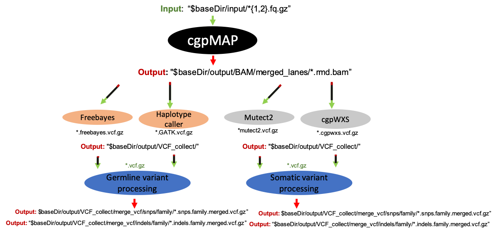

# UEA BCRE pipelines - DNAseq

# Introduction

This README explains how the inputs / outputs are organised and how this connects multiple nextflow pipeline scripts together. For more in-depth details about the individual pipelines please select from the list below:

- cgpMAP ([link](Exome/cgpmap/README.md))
- cgpWXS ([link](Exome/somatic/cgpwxs/README.md))
- cgpWGS ([link](WGS/somatic/cgpwgs/README.md))
- Mutect2 ([link](Exome/somatic/mutect2/README.md))
- Haplotypcaller (no documentation*)
- Freebayes (no documentation*)
- Variant processing ...

*_no documentation for these pipelines as they are straightforward - the move linearly from process to process. Please look at the .nf file to identify the tools that are run in these pipelines._

# Connecting pipelines

In order to connect the pipelines the outputs from one pipeline mush match what is described in the next pipelines input variable - in both name and location. A graphic is shown below how the pipelines are linked:

