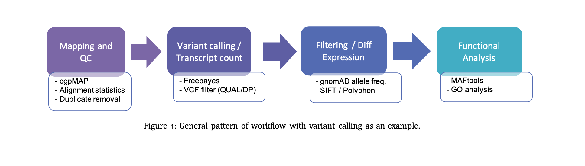
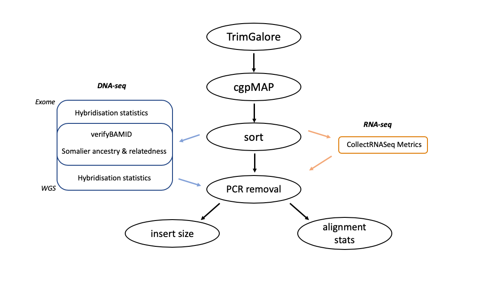

# UEA BCRE pipelines

 

<!-- TABLE OF CONTENTS -->
## Table of Contents

 

* [Introduction](#Introduction)
  - [Quality Control](#Quality-Control)
  - [Pipelines](#Pipelines-available)

 

## Introduction

 

At UEA bob champion genomics we have developed a number of pipelines specialising for processing sequencing data. We have developed a system that allows the easy use of these pipelines by downloading the github repository, moving fastq files into input directory and configuring which analyses to perform by configuring the "XXX.config" file.

 

Irrespective of the pipelines chosen, all workflows perform similar analyses:

 

 

### Quality Control

 

The quality control pipeline contains a static backbone that is present with all data types (black). Dependent on the type of data used extra tools are added onto this backbone (shown in figure 2 below). Therefore, if you are planning to process exome dna-seq data for somatic mutations then you would select "exome-somatic_QC" in the config file so it know to include tools to measure hybridisation stats.

 

 

### Pipelines available

Current pipelines are able to process the following data input:

DNA-seq:

  - Exome-germline (Freebayes and GATK HaplotypeCaller)
  - Exome-somatic (Sanger-cgpWXS and GATK Mutect2)

  - Whole-genome germline (Freebayes and GATK HaplotypeCaller)
  - Whole-genome somatic (Sanger-cgpWGS and GATK Mutect2)
  - Whole-genome structural variants (Sanger-XXX)
