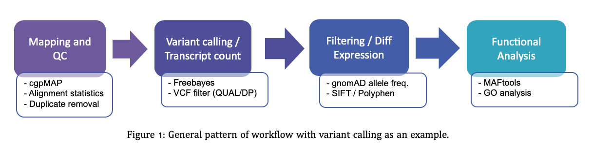

# UEA BCG pipelines

 

<!-- TABLE OF CONTENTS -->
## Table of Contents

 

* [Introduction](#Introduction)

 
 

## Introduction

 

At UEA bob champion genomics we have developed a number of pipelines specialising for processing sequencing data. We have developed a system that allows the easy use of these pipelines by downloading this github repository, moving fastq files into input directory and configuring which analyses to perform by configuring the "XXX.config" file.

 

Irrespective of the pipelines chosen, all workflows perform similar analyses:

 
 

 
 

The pipelines were designed to perform the complete bioinformatics analysis,

fit together

therefore input fastq files are first

### Quality Control

  - Exome

####DNA:

  Exome:

  +-- Mapping and QC (cgpMAP)

    Germline:
      +-- Freebayes
      +-- GATK HaplotypeCaller

    Somatic:
      +-- Sanger cgpWXs
      +-- GATK Mutects

  Whole Genome:

  +-- Mapping and QC (cgpMAP)

    Germline:
      +-- Freebayes
      +-- GATK HaplotypeCaller

    Somatic:
      +-- Sanger cgpWGS
      +-- GATK Mutects
