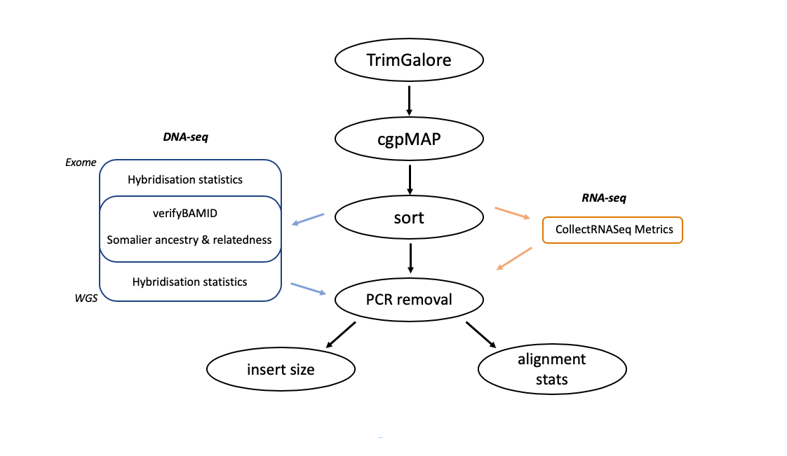

# UEA BCRE pipelines


<br />

<!-- TABLE OF CONTENTS -->
## Table of Contents

<br />

* [Introduction](#Introduction)
  - [Quality Control](#Quality-Control)
  - [Pipelines](#Pipelines-available)

* [Usage](#Usage)
  - [Software Requirements](#Software-Requirements)
  - [Example](#Example)

<br />


## Introduction

<br />

At UEA bob champion genomics we have developed a number of pipelines specialising for processing sequencing data. We have developed a system that allows the easy use of these pipelines by downloading the github repository, moving fastq files into input directory and configuring which analyses to perform by configuring the "XXX.config" file. The pipeline has been written using the nextflow workflow management.

<br />

Irrespective of the pipelines chosen, all workflows perform similar analyses:

<br />


<br />


### Quality Control

<br />

The quality control pipeline contains a static backbone that is present with all data types (black). Dependent on the type of data used extra tools are added onto this backbone (shown in figure 2 below). Therefore, if you are planning to process exome dna-seq data for somatic mutations then you would select "exome-somatic_QC" in the config file so it know to include tools to measure hybridisation stats.

<br />




### Pipelines available

After alignment and QC, the following pipelines are available to process your samples. For more information about the steps involved in these - click on the links below.

DNA-seq:

  - Exome-germline (Freebayes and GATK HaplotypeCaller)
  - Exome-somatic (Sanger-cgpWXS and GATK Mutect2)

  - Whole-genome germline (Freebayes and GATK HaplotypeCaller)
  - Whole-genome somatic (Sanger-cgpWGS and GATK Mutect2)
  - Whole-genome structural variants (Sanger-XXX)


RNA-seq:

  - mRNA RNA-seq (Hisat2)


## Usage

### Software Requirements

As a mininum you will require the following dependencies:

  - Singularity (v3+)
  - Nextflow (v19+)
  - Python 3+
  - git and git account
  - An account on the HPC..!!! you do it this way...??


### Tutorial

#### 1. Download repo

In order to test the pipeline download clone this repository to your working directory using:

```
git clone https://github.com/R-Cardenas/pipelines_clean.git
```

This will download all the scripts in addition to some test data directly into the input folder so that the pipeline can be tested (The input folder is where your fastq files are to go also.)


#### 2. Modify the config file
